# Procesverslag

## Noa Bos

### Ontwerper:
Noa Bos, 500791864

#### Je startniveau:
Mijn startniveau is: Blauw. En mijn gekozen karakter is Spiderman.

# Je plan

   ### De eerste versie/schets:
  
  
  
Mijn uiteindelijke concept: In mijn concept zie je een strippagina van een comicbook. Hierin staat de skyline van New York, alle wolkenkrabbers zijn knoppen. Wanneer je op een knop klikt, zie je Spiderman verschijnen in een nieuw pak. 

  
  ### Je ambitie: 
  Aan deze technieken/punten wil ik werken:
  - Ik wil meer leren over keyframes, het opzetten van een eigen animatie.
  - Ik wil leren hoe ik een customfont in mijn HTML en CSS neer kan zetten.
  - Ik wil leren hoe ik JS en CSS kan combineren tot 1 design.
  - Ik wil bezig zijn met het schrijven van nette en overzichtelijke HTML code.
  - Ik wil een leuk eindproduct neerzetten, wat passend is bij Spiderman
 

## Voortgang/Feedback 1

  
Mijn bevindingen
  
  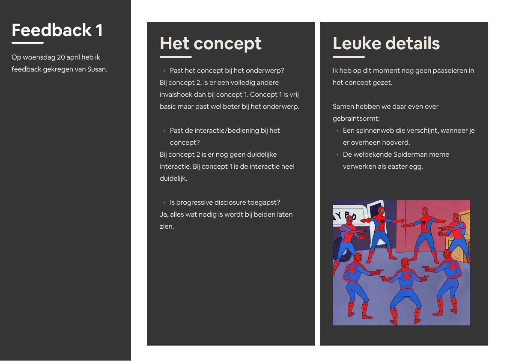
 
  Tijdens de eerste feedback ronde had ik nog niet veel om te laten zien, dus veel moest nog worden uitgewerkt. Echter is er positieve feedback gegeven op de schetsen.
  
  ### Bevinding 1 | Saai concept:
 Mijn eerste concept was een beetje saai en had weinig interactie.

  #### oplossing 1 | Saai concept:
Samen met Susan hebben we nagedacht over het maken van een interactief ontwerp. Dit was niet makkelijk. Zo zijn we op een hover idee gekomen, wanneer je hooverd verschijnt er een nieuwe Spiderman.

   ### Bevinding 2 | Te moeilijk:
Mijn eerste concept was nog iets te hooggegrepen en moeilijk pasbaar te maken op een interessant ontwerp. Samen met Sanne en Susan hebben we nagedacht over aanpassingen aan het concept.

  #### oplossing 2 | Te moeilijk:
Het is een volledig anders concept geworden. Geen masker, maar een modeshow! Eerst wilde ik Spiderman op een catwalk laten lopen, dit is alleen niet iets wat past bij Spiderman. Toen leek het ons leuk om New York te combineren met Spiderman. Wanneer je klikt op een gebouw, verschijnt er een nieuwe outfit.

   ### Bevinding 3 | Meme:
Het leek ons leuk om de Spiderman meme als interactieve pagina te maken, hoe ik dat dan zou laten zien, was nog even draag. Er is dus een derde concept ontstaan! 

  #### oplossing 3 | Meme:
Dit concept zou veel illustreren zijn, iets wat ik een beetje zonde van mijn tijd vindt. Deze tijd steek ik liever in het coderen.
  
   ### Bevinding 4 | Paaseieren:
Beiden concepten hadden nog geen paaseieren, of andere leuke details.

  #### oplossing 4 | Paaseieren:
Om de paaseieren te verwerken in het design, hebben we gekeken naar de omgeving New York. Ook heb ik even gekeken tussen de verschillende animatie opties die er zijn, hierdoor heb ik veel inspiratie gekregen.
  
     ### Bevinding 5 | Interacties:
Verschillende interacties die passen bij het karakter.

  #### oplossing 5 | Interacties:
Na het zien van de verschillende keyframes, heb ik veel inspiratie gekregen. Susan heeft me veel kunnen helpen in het inschatten van de moeilijkheidsgraad. Zo hebben we gekeken naar het animeren van een web en de mogelijkheden daarbij.
 

## Voortgang/Feedback 2

 
Mijn bevindingen
  
  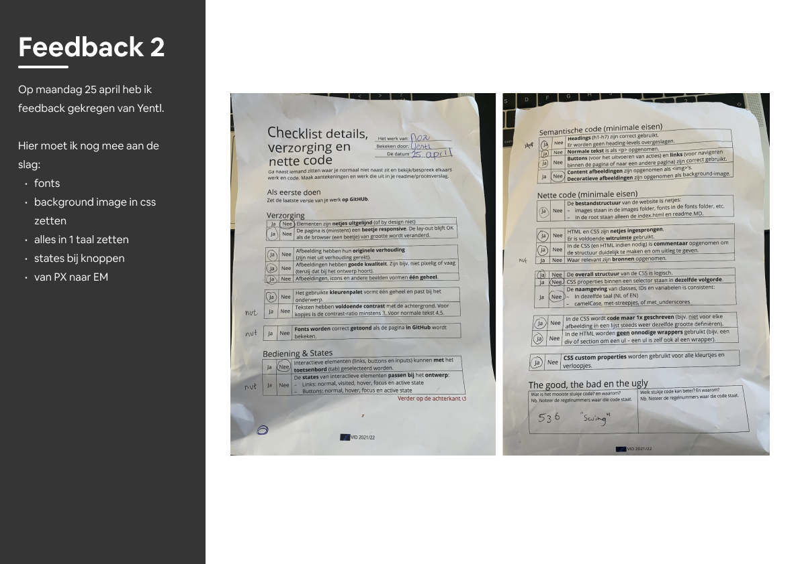

De meeste punten in de checklist heb ik goed afgerond, er zijn nog kleine dingen die ik moet aanpassen. Echter zijn er natuurlijk altijd verbeterpunten of tips voor in het vervolgproces. 
  
  ### Bevinding 1 | Fonts:
 Ik heb nog geen fonts toegepast, via een tutorial wist ik wel fontsquirel te gebruiken. Verder kwam ik niet.

  #### oplossing 1 | Fonts:
De les na de feedback legde Sanne uit hoe dit moest. 

   ### Bevinding 2 | Background:
Ik had de achtergrond als gewone afbeelding in HTML gezet.

  #### oplossing 2 | Background:
  Dit vond ik heel lastig om te veranderen, de mappen lukte niet en de styling is niet responsive. 

   ### Bevinding 3 | Taal:
De taal was heel rommelig en alles doorelkaar, engels en nederlands.

  #### oplossing 3 | Taal:
Dit was gemakkelijk te veranderen!
  
   ### Bevinding 4 | PX to EM:
Ik had alles nog in pixels staan.

  #### oplossing 4 | PX to EM:
Het werken met PX vind ik wel veel fijner dan EM, ik heb alles succesvol om kunnen zetten.
  
     ### Bevinding 5 | States:
Ik had nog geen states bij de knoppen.

  #### oplossing 5 | States:
  Ik heb gemakkelijk de states toe kunnen voegen, doormiddel van raampjes bij de wolkenkrabbers. Ik heb alleen bewust geen hover state toegevoegd, dit werd echt heel lelijk.

## Voortgang/Feedback 3

 
Mijn bevindingen
  
  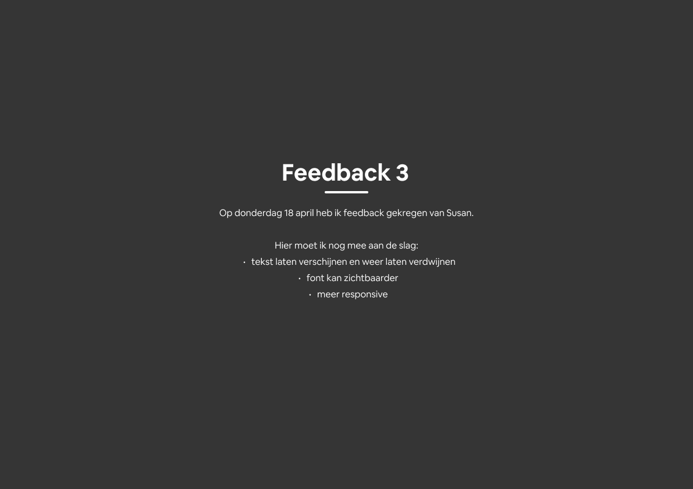

  ### Bevinding 1 | Informatie mist:
Er verschijnt nog geen informatie wanneer Spiderman verschijnt.

  #### oplossing 1 | Informatie mist:
Dit heb ik toe kunnen voegen door JS. Het is niet helemaal gelukt, bij een tweede klik, verschijnt het niet nog een keer.

   ### Bevinding 2 | Font:
De font van Spiderman is niet helemaal duidelijk.
  
  #### oplossing 2 | Font:
Deze heb ik groter kunnen maken, ook is het contrast duidelijker. Wel vind ik het erg leuk dat hij achter de wolkenkrabbers staat.

   ### Bevinding 3 | Responsive:
De website is niet volledig responsive.

  #### oplossing 3 | Responsive:
Dit lukt me niet helemaal, de background maakt het heel lelijk.
  
   ### Bevinding 4 | Vlammetje:
Het random vlammetje heeft geen betekenis.
  
  #### oplossing 4 |  Vlammetje:
Ik heb het vlammetje laten verschijnen door een botsting tussen 2 taxi's. Nu komt het geheel wat meer samen.
  
     ### Bevinding 5 | Taxi staat in spiegelbeeld:
De letters taxi stonden in spiegelbeeld.

  #### oplossing 5 | Taxi staat in spiegelbeeld:
Dit heb ik kunnen veranderen in illustrator :).

# Overige proces details
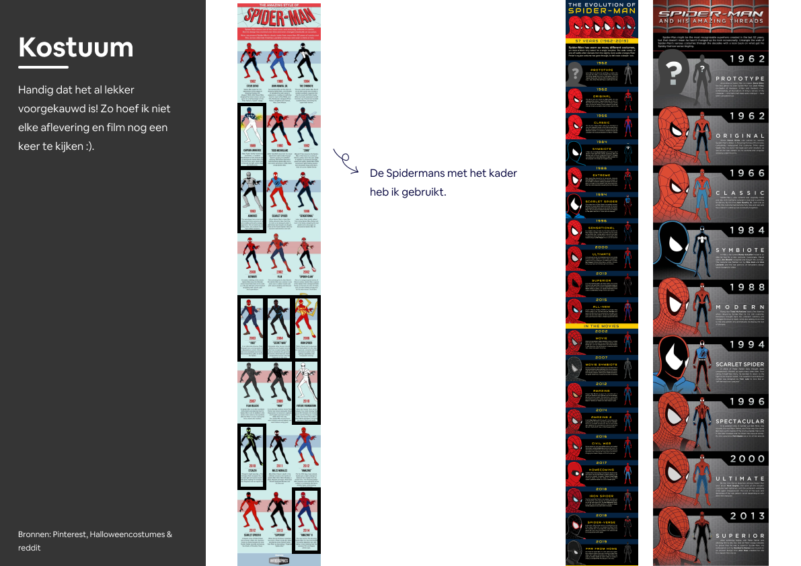
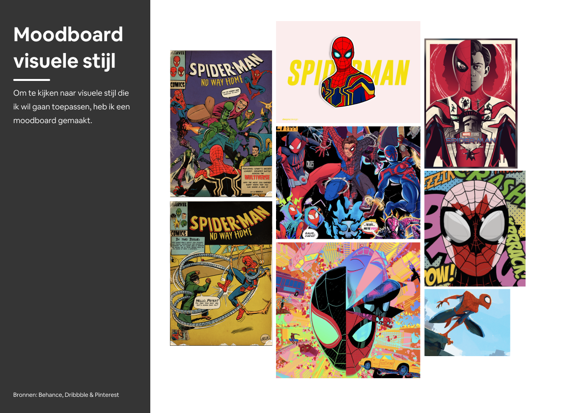
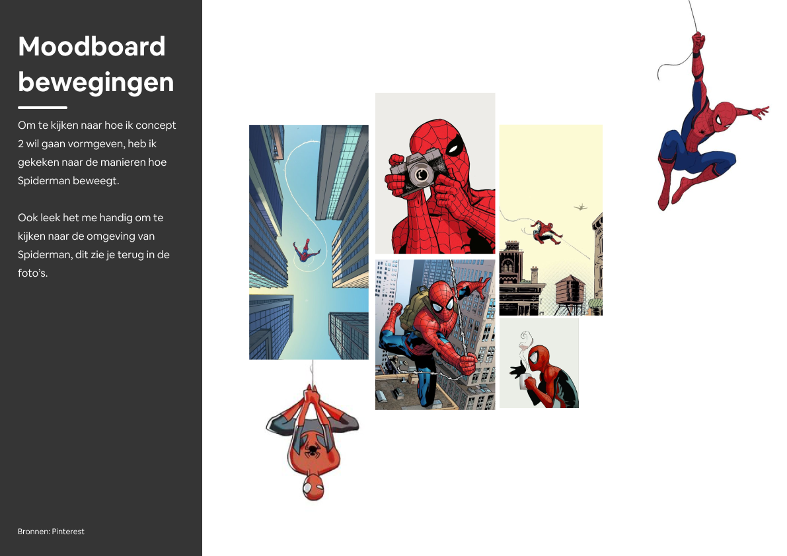
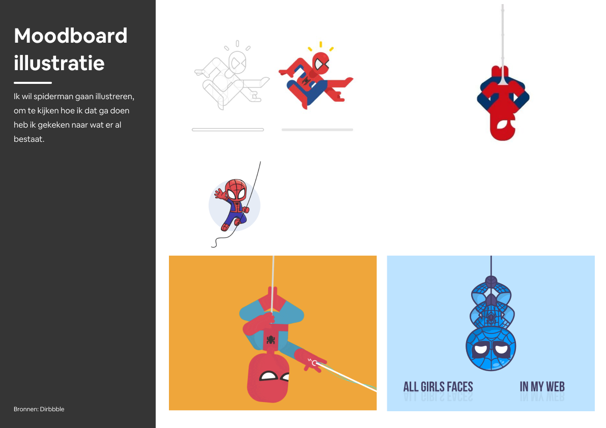
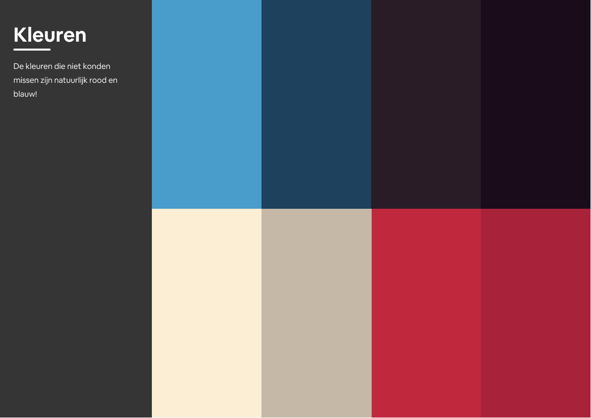
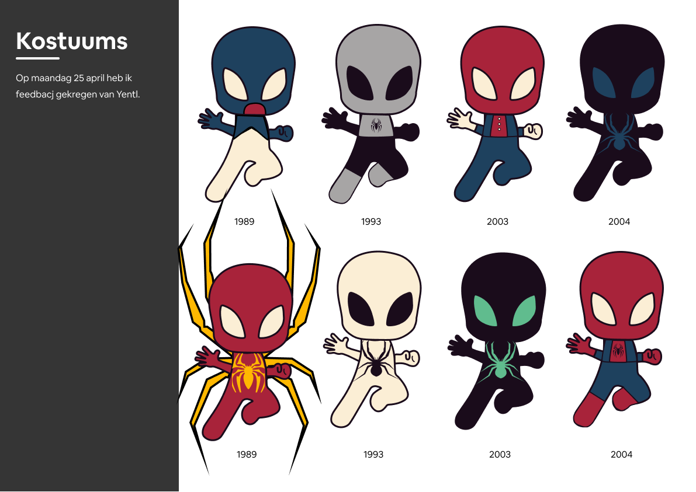
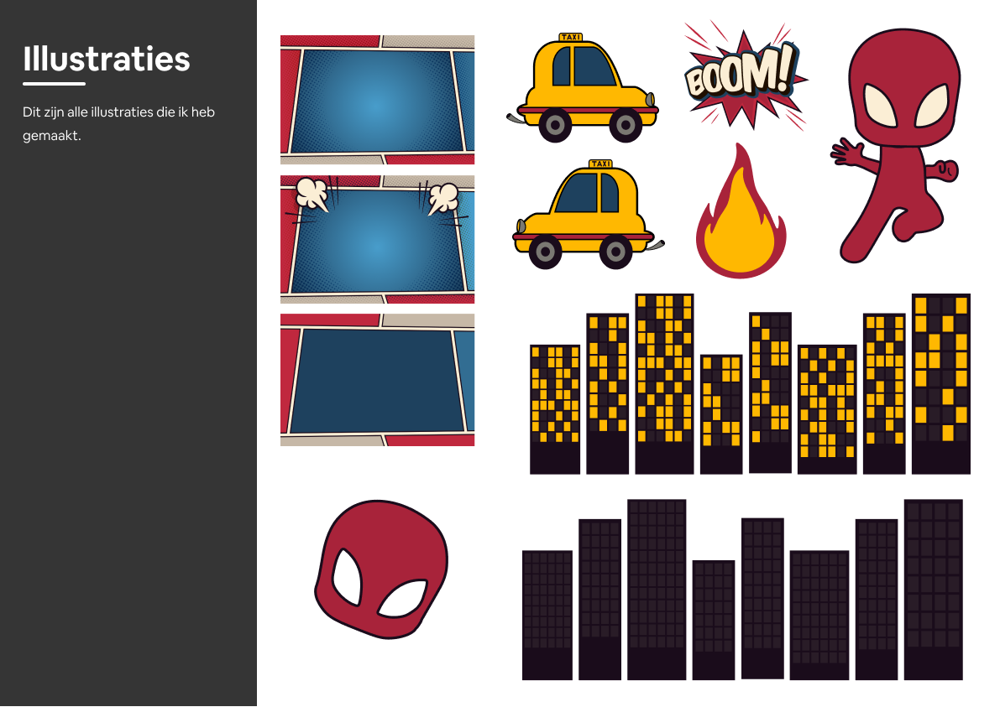

## Reflectie

  
Mijn eindresultaat & persoonlijke ontwikkeling

  ### Je uitkomst - karakteristiek screenshot(s):
  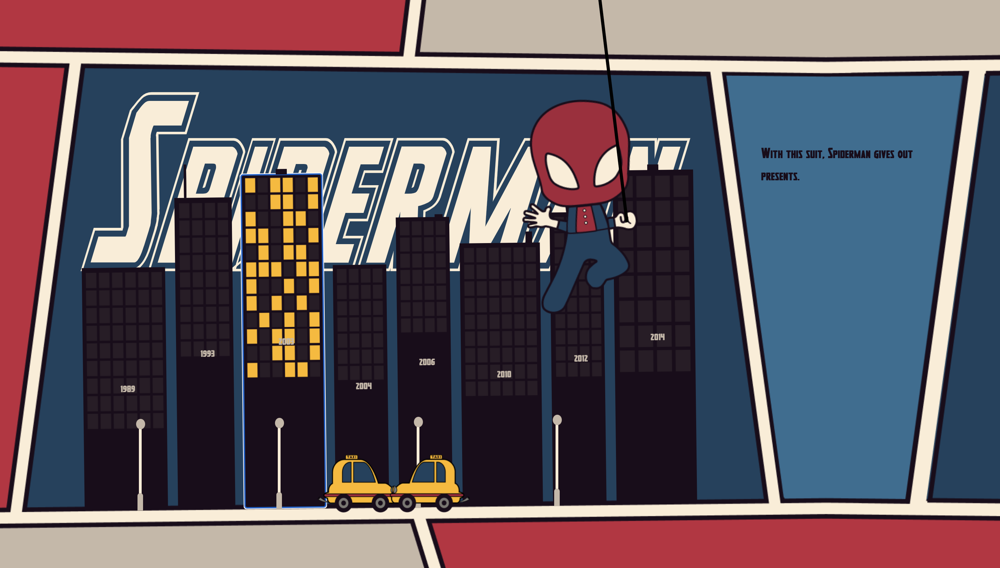

  ### Dit ging goed/Heb ik geleerd: 
Ik ben blij hoe het in zijn geheel is uitgevallen. Er zijn vrij veel schoonheids foutjes en dingen die ik beter had gezien. Ik heb veel geleerd over keyframes en animaties, ik weet ik noe hoe ik customfonts moet gebruiken. Ik vond het een leuk vak en ook een hele leuke opdracht. Ik heb veel om hulp gevraagd en heb ook veel kunnen leren van anderen. Code blijft voor mij lastig, toch heb ik er wat meer plezier in gekregen. Ook vond ik het erg leuk om bezig te zijn met het maken van een ontwerp, en te zien hoe ik dit kon toepassen met de code die ik begreep. Het combineren van JS en HTML blijf ik lastig vinden.

     ### Hier ben ik trots op:
  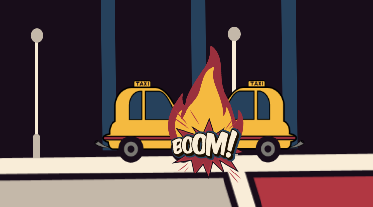
Voor veel animaties heb ik hulp gehad, zoals met de swing en de dangle. Het was ook heel lastig om hier een web aan te verbinden. Ook hiervoor heb ik hulp gevraagd. Het werken in de lessen en in de medialounge vond ik erg fijn, hierdoor maakte ik ook veel stappen vooruit. Elke les had ik een doel, wat ik aan het einde van de les gedaan wilde hebben. Dit is ook altijd goed gelukt. De animatie die we hier zien, is een animatie die ik zonder hulp heb kunnen maken, daar ben ik erg blij mee.

  ### Dit was lastig/Is niet gelukt:
  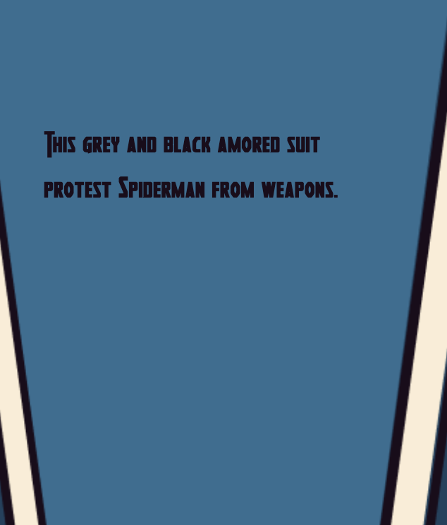
   De tekst verschijnt en verdwijnt weer na 6 of meer seconden. Alleen wanneer hij is verdwenen, verschijnt de tekst niet meer, van een andere spiderman. Hier ben ik lang mee bezig geweest, maar dit is een JS probleem, en JS blijf ik lastig vinden. Ook vind ik de tekst op de buttons niet goed leesbaar, ook dit had ik beter kunnen doen. Daarnaast ben ik nog niet helemaal tevreden over de vormgeving in zijn geheel, hier heb ik weinig tijd inzitten. Deze tijd wilde ik liever in het coderen stoppen. Ook ben ik niet blij met het responsive gedeelte, dit is iets wat me totaal niet lukte. 

## Bronnenlijst

1. https://www.dafont.com/heroes-assemble.font 
2. https://www.fontsquirrel.com/tools/webfont-generator 
3. https://bobbyhadz.com/blog/javascript-hide-element-after-few-seconds 
4. https://codepen.io/amlivgl/pen/mNYwyw 
5. https://redstapler.co/pure-css-horizontal-scrolling-website-tutorial/
6. https://stackoverflow.com/questions/22331008/using-calc-to-transition-width-and-height-in-ie 
7. https://stackoverflow.com/questions/9916354/is-it-valid-to-have-a-section-tag-inside-another-section-tag  
8. https://forum.freecodecamp.org/t/trigger-animations-with-button-press/214733/4 
9. Ik heb heel veel gehad aan de hulp van Sanne en Susan!

